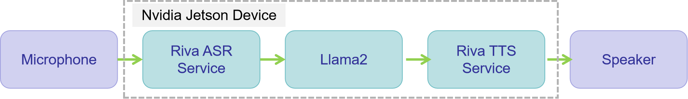
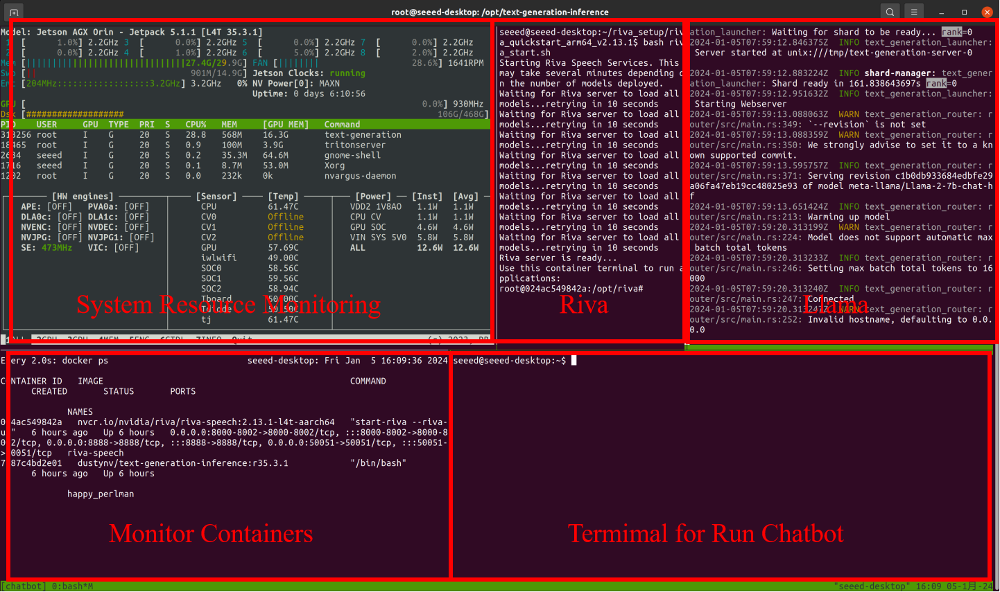

# Local Voice Chatbot : Deploy Riva and LLama on Jetson

## Introduction


In this repository, we will demonstrate how to build your own local voice chatbot using open-source resources. Specifically, we use [Nvidia Riva](https://docs.nvidia.com/deeplearning/riva/user-guide/docs/quick-start-guide.html) to facilitate the conversion between voice and text, and employ the [Meta Llama](https://huggingface.co/meta-llama) large language model to generate answers to questions. This repository implements the voice chatbot with very concise code, allowing readers to quickly grasp the underlying principles.

We will install two services, Riva and [text-generation-inference](https://github.com/huggingface/text-generation-inference)(
we can load large models in this inference service), on Jetson and use the code from this repository as a client for functional testing.

## Prerequisites
- Jetson device with more than 16GB of memory.
- The hardware device needs to be pre-flashed with the jetpack 5.1.1 operating system.

(I completed all experiments using [Jetson AGX Orin 32GB H01 Kit](https://www.seeedstudio.com/AGX-Orin-32GB-H01-Kit-p-5569.html?queryID=012e528073e90bf80afd3880f3fc2b13&objectID=5569&indexName=bazaar_retailer_products), but you can try loading smaller models with a device that has less memory.)

## Installation
- **Step1.** [Install Nvidia Riva Server on Jetson.](https://docs.nvidia.com/deeplearning/riva/user-guide/docs/quick-start-guide.html#embedded)
- **Step2.** [Deploy text-generation-inference on Jetson](https://github.com/dusty-nv/jetson-containers/tree/cb6c847f88df221e705397a1ee98424c2e893243/packages/llm/text-generation-inference)
- **Step3.** Clone local chatbot demo.
    ```sh
    git clone https://github.com/yuyoujiang/Deploy-Riva-LLama-on-Jetson.git
    ```

## Let's Run It!
**Note:** Each of the following steps requires opening a new terminal window.



- **Step1.** Start the Riva Server.
    ```sh
    cd <path to riva quickstart directory>
    bash riva_start.sh
    ```
- **Step2.** Use the `text-generation-inference` to load `Llama` large language model.
    ```sh
    text-generation-launcher --model-id meta-llama/Llama-2-7b-chat-hf --port 8899
    ```
- **Step3.** Run local chatbot demo.
    - Enter the working directory.
        ```sh
        cd <path to Deploy-Riva-LLama-on-Jetson>
        ```
    - Query audio input devices.
        ```sh
        python3 local_chatbot.py --list-input-devices
        ```
    - Query audio output devices.
        ```sh
        python3 local_chatbot.py --list-output-devices
        ```
    - Run the script.
        ```sh
        python3 local_chatbot.py --input-device <your device id> --output-device <your device id>
        # For example: python3 local_chatbot.py --input-device 25 --output-device 30
        ```

```HTML
<video width="320" height="240" controls>
    <source src="https://youtu.be/Nc3D-qITDoU" type="video/mp4">
</video>
```

## References
- [build-an-ai-chatbot-using-riva-and-openai](https://www.hackster.io/wxxniubi8/build-an-ai-chatbot-using-riva-and-openai-13dc41)
- [https://github.com/dusty-nv/jetson-containers](
https://github.com/dusty-nv/jetson-containers/tree/cb6c847f88df221e705397a1ee98424c2e893243/packages/llm/text-generation-inference)
- https://github.com/huggingface/text-generation-inference
- https://huggingface.co/meta-llama
